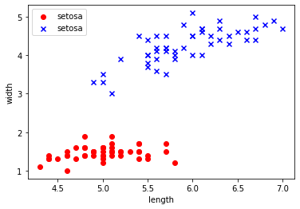
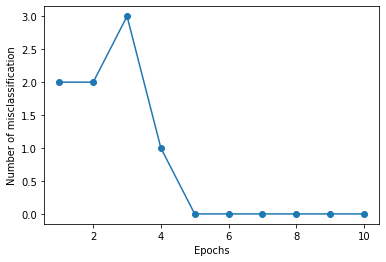
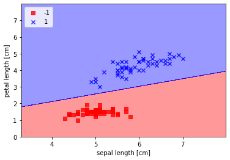
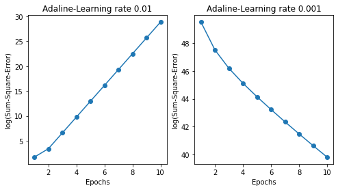
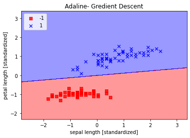
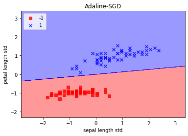
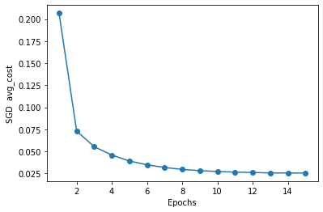

```python
#导入包
import pandas as pd
import numpy as np
import matplotlib.pyplot as plt
#读取数据，设置列名，查看
iris_df=pd.read_csv('../data/iris/iris.data')
iris_df.columns=['sepal length','sepal width','petal length','petal width','class']
iris_df.head()
```


<div>
<style scoped>
    .dataframe tbody tr th:only-of-type {
        vertical-align: middle;
    }

    .dataframe tbody tr th {
        vertical-align: top;
    }

    .dataframe thead th {
        text-align: right;
    }
</style>
<table border="1" class="dataframe">
  <thead>
    <tr style="text-align: right;">
      <th></th>
      <th>sepal length</th>
      <th>sepal width</th>
      <th>petal length</th>
      <th>petal width</th>
      <th>class</th>
    </tr>
  </thead>
  <tbody>
    <tr>
      <th>0</th>
      <td>4.9</td>
      <td>3.0</td>
      <td>1.4</td>
      <td>0.2</td>
      <td>Iris-setosa</td>
    </tr>
    <tr>
      <th>1</th>
      <td>4.7</td>
      <td>3.2</td>
      <td>1.3</td>
      <td>0.2</td>
      <td>Iris-setosa</td>
    </tr>
    <tr>
      <th>2</th>
      <td>4.6</td>
      <td>3.1</td>
      <td>1.5</td>
      <td>0.2</td>
      <td>Iris-setosa</td>
    </tr>
    <tr>
      <th>3</th>
      <td>5.0</td>
      <td>3.6</td>
      <td>1.4</td>
      <td>0.2</td>
      <td>Iris-setosa</td>
    </tr>
    <tr>
      <th>4</th>
      <td>5.4</td>
      <td>3.9</td>
      <td>1.7</td>
      <td>0.4</td>
      <td>Iris-setosa</td>
    </tr>
  </tbody>
</table>
</div>


```python
#查看数据的结构信息和统计信息
iris_df.info()
iris_df.describe().T
```

    <class 'pandas.core.frame.DataFrame'>
    RangeIndex: 149 entries, 0 to 148
    Data columns (total 5 columns):
     #   Column        Non-Null Count  Dtype  
    ---  ------        --------------  -----  
     0   sepal length  149 non-null    float64
     1   sepal width   149 non-null    float64
     2   petal length  149 non-null    float64
     3   petal width   149 non-null    float64
     4   class         149 non-null    object 
    dtypes: float64(4), object(1)
    memory usage: 5.9+ KB
    


<div>
<style scoped>
    .dataframe tbody tr th:only-of-type {
        vertical-align: middle;
    }

    .dataframe tbody tr th {
        vertical-align: top;
    }

    .dataframe thead th {
        text-align: right;
    }
</style>
<table border="1" class="dataframe">
  <thead>
    <tr style="text-align: right;">
      <th></th>
      <th>count</th>
      <th>mean</th>
      <th>std</th>
      <th>min</th>
      <th>25%</th>
      <th>50%</th>
      <th>75%</th>
      <th>max</th>
    </tr>
  </thead>
  <tbody>
    <tr>
      <th>sepal length</th>
      <td>149.0</td>
      <td>5.848322</td>
      <td>0.828594</td>
      <td>4.3</td>
      <td>5.1</td>
      <td>5.8</td>
      <td>6.4</td>
      <td>7.9</td>
    </tr>
    <tr>
      <th>sepal width</th>
      <td>149.0</td>
      <td>3.051007</td>
      <td>0.433499</td>
      <td>2.0</td>
      <td>2.8</td>
      <td>3.0</td>
      <td>3.3</td>
      <td>4.4</td>
    </tr>
    <tr>
      <th>petal length</th>
      <td>149.0</td>
      <td>3.774497</td>
      <td>1.759651</td>
      <td>1.0</td>
      <td>1.6</td>
      <td>4.4</td>
      <td>5.1</td>
      <td>6.9</td>
    </tr>
    <tr>
      <th>petal width</th>
      <td>149.0</td>
      <td>1.205369</td>
      <td>0.761292</td>
      <td>0.1</td>
      <td>0.3</td>
      <td>1.3</td>
      <td>1.8</td>
      <td>2.5</td>
    </tr>
  </tbody>
</table>
</div>


```python
#截取需要的原始数据（包含两个类别）
y=iris_df.iloc[0:99,4].values
#使用where来进行类标编码，将匹配到的类别替换为-1，其余的类别替换为1
y=np.where(y=='Iris-setosa',-1,1)
#选取花瓣长度和花萼长度来作为x
x=iris_df.iloc[0:99,[0,2]].values
#绘制第一个类别的散点图
plt.scatter(x[:49,0],x[:49,1],color='red',marker='o',label='setosa')
#绘制第二个类别的散点图
plt.scatter(x[49:99,0],x[49:99,1],color='blue',marker='x',label='setosa')
plt.xlabel('length')
plt.ylabel('width')
plt.legend(loc='upper left')
plt.show()
```


    

    


```python
#感知机实现函数
class Perceptron:
    def __init__(self,eta=0.01,n_iter=10):
        self.eta=eta
        self.n_iter=n_iter
    def net_input(self,x):
        """
        获取净输入
        :param x: DataFrame
        :return matrix:
        """
        return np.dot(x,self.w_[1:])+self.w_[0]


    def predict(self,x):
        """
        获取二分类的预测值，0为分界
        :param x:DataFrame
        :return:
        """
        return np.where(self.net_input(x)>=0.0,1,-1)


    def fit(self,x,y):
        #初始化权重，外加一个w0，也就是阈值
        self.w_=np.zeros(1+x.shape[1])
        #保存累计迭代的错误次数
        self.errors_=[]
        #开始迭代
        for _ in range(self.n_iter):
            errors=0
            for xi,target in zip(x,y):
                #权重更新
                update=self.eta*(target-self.predict(xi))
                self.w_[1:]+=update*xi
                self.w_[0]+=update
                # print(self.w_,update,xi)   查看每步过程中的变化
                #记录本次迭代错误次数
                errors+=int(update!=0.0)
            self.errors_.append(errors)
        return self
```


```python
#绘制迭代次数和预测错误次数关系图
ppn=Perceptron(eta=0.1,n_iter=10)
ppn.fit(x,y)
plt.plot(range(1,len(ppn.errors_)+1),ppn.errors_,marker='o')
plt.xlabel('Epochs')
plt.ylabel('Number of misclassification')
plt.show()    #发现在迭代次数达到5的时候错误数量降为0

```


    

    


```python
from matplotlib.colors import ListedColormap
def plot_decision_regins(x,y,classfier,resolution=0.01):
    #设置标记和色图
    makers=('s','x','o','^','v')
    colors=('red','blue','lightgreen','gray','cyan')
    cmap=ListedColormap(colors[:len(np.unique(y))])

    #绘制决策表面
    x1_min,x1_max=x[:,0].min()-1,x[:,0].max()+1
    x2_min,x2_max=x[:,1].min()-1,x[:,0].max()+1
    #设置格子矩阵
    xx1,xx2=np.meshgrid(np.arange(x1_min,x1_max,resolution),
                        np.arange(x2_min,x2_max,resolution))
    z=classfier.predict(np.array([xx1.ravel(),xx2.ravel()]).T)
    z=z.reshape(xx1.shape)
    #绘制轮廓图  contour and fill
    plt.contourf(xx1,xx2,z,alpha=0.4,cmap=cmap)
    plt.xlim(xx1.min(),xx1.max())
    plt.ylim(xx2.min(),xx2.max())

    #绘制分类样本
    #enumerate返回索引和值
    for idx,cl in enumerate(np.unique(y)):
        plt.scatter(x=x[y==cl,0],y=x[y==cl,1],
                    alpha=0.8,c=cmap(idx),
                    marker=makers[idx],label=cl)
```


```python
#绘制线性决策区域
plot_decision_regins(x,y,classfier=ppn)
plt.xlabel('sepal length [cm]')
plt.ylabel('petal length [cm]')
plt.legend(loc='upper left')
plt.show()
```

    *c* argument looks like a single numeric RGB or RGBA sequence, which should be avoided as value-mapping will have precedence in case its length matches with *x* & *y*.  Please use the *color* keyword-argument or provide a 2-D array with a single row if you intend to specify the same RGB or RGBA value for all points.
    *c* argument looks like a single numeric RGB or RGBA sequence, which should be avoided as value-mapping will have precedence in case its length matches with *x* & *y*.  Please use the *color* keyword-argument or provide a 2-D array with a single row if you intend to specify the same RGB or RGBA value for all points.
    


    

    


```python
#AdalineGD  自适应梯度下降,是典型的批量梯度下降方法
class AdalineGD:
    """
    批量梯度下降算法
    优点：误差曲面较为平滑
    缺点：当数据量非常大的时候，计算成本非常高，每次需要全部样本评估
    """
    def __init__(self,eta=0.01,n_iter=50):
        self.eta=eta
        self.n_iter=n_iter
    def net_input(self,x):
        """
        获取净输入
        :param x: DataFrame
        :return mateix:
        """
        return np.dot(x,self.w_[1:])+self.w_[0]


    def predict(self,x):
        """
        获取二分类的预测值，0为分界
        :param x:DataFrame
        :return:
        """
        return np.where(self.activation(x)>=0.0,1,-1)
    def activation(self,x):
        return self.net_input(x)


    def fit(self,x,y):
        #初始化权重，外加一个w0，也就是阈值
        self.w_=np.zeros(1+x.shape[1])
        #保存累计迭代的错误次数
        self.cost_=[]
        #开始迭代
        for i in range(self.n_iter):
            output=self.net_input(x)
            errors=y-output
            self.w_[1:]+=self.eta*x.T.dot(errors)
            self.w_[0]+=self.eta*errors.sum()
            #使用误差平方和来计算损失
            cost=(errors**2).sum()/2.0
            self.cost_.append(cost)
        return self
```


```python
#绘制不同学习率情况下，误差的情况
fig,ax=plt.subplots(nrows=1,ncols=2,figsize=(8,4))
ada1=AdalineGD(n_iter=10,eta=0.01).fit(x,y)
ax[0].plot(range(1,len(ada1.cost_)+1),
           np.log10(ada1.cost_),marker='o')
ax[0].set_xlabel('Epochs')
ax[0].set_ylabel('log(Sum-Square-Error)')
ax[0].set_title('Adaline-Learning rate 0.01')
ada2=AdalineGD(n_iter=10,eta=0.0001).fit(x,y)
ax[1].plot(range(1,len(ada2.cost_)+1),
           ada2.cost_,marker='o')
ax[1].set_xlabel('Epochs')
ax[1].set_ylabel('log(Sum-Square-Error)')
ax[1].set_title('Adaline-Learning rate 0.001')
plt.show()
```


    

    


```python
#通过上述的学习速率对比，0.001学习速率最终达到了收敛，但是由于设置的学习速率过小，
#也导致了迭代次数的增加。在此我们对数据进行标准化再来使用0.01来测试一下
x_std=np.copy(x)
x_std[:,0]=(x_std[:,0]-x_std[:,0].mean())/x_std[:,0].std()
x_std[:,1]=(x_std[:,1]-x_std[:,1].mean())/x_std[:,1].std()
ada=AdalineGD(n_iter=15,eta=0.01)
ada.fit(x_std,y)
plot_decision_regins(x_std,y,classfier=ada)
plt.title('Adaline- Gredient Descent')
plt.xlabel('sepal length [standardized]')
plt.ylabel('petal length [standardized]')
plt.legend(loc='upper left')
plt.show()
plt.plot(range(1,len(ada.cost_)+1),ada.cost_,marker='o')
plt.xlabel('Epochs')
plt.ylabel('Sum-square-error')
plt.show()
```

    *c* argument looks like a single numeric RGB or RGBA sequence, which should be avoided as value-mapping will have precedence in case its length matches with *x* & *y*.  Please use the *color* keyword-argument or provide a 2-D array with a single row if you intend to specify the same RGB or RGBA value for all points.
    *c* argument looks like a single numeric RGB or RGBA sequence, which should be avoided as value-mapping will have precedence in case its length matches with *x* & *y*.  Please use the *color* keyword-argument or provide a 2-D array with a single row if you intend to specify the same RGB or RGBA value for all points.
    


    

    


    

    


```python
from numpy.random import seed
class AdalineSGD:
    """
    自适应线性随机梯度下降算法
    """
    def __init__(self,eta=0.1,n_iter=10,shuffle=True,random_state=None):
        self.eta=eta
        self.n_iter=n_iter
        self.w_initialized=False
        self.shuffle=shuffle
        if random_state:
            seed(random_state)
    def _initialize_weights(self,m):
        self.w_=np.zeros(1+m)
        self.w_initialized=True

    def net_input(self,x):
        """
        获取净输入
        :param x: DataFrame
        :return mateix:
        """
        return np.dot(x,self.w_[1:])+self.w_[0]

    def predict(self,x):
        return np.where(self.activation(x)>=0.0,1,-1)


    def activation(self,x):
        return self.net_input(x)

    def _update_weights(self,xi,target):
        output=self.net_input(xi)
        error=(target-output)
        self.w_[1:]+=self.eta*xi*error
        self.w_[0]+=self.eta*error
        cost=0.5*error**2
        return cost


    def partial_fit(self,x,y):
        if not self.w_initialized:
            self._initialize_weights(x.shape[1])
        if y.ravel().shape[0]>1:
            for xi,target in zip(x,y):
                self._update_weights(xi,target)
        else:
            self._update_weights(x,y)
        return self
    def _shuffle(self,x,y):
        r=np.random.permutation(len(y))
        return x[r],y[r]

    def fit(self,x,y):
        self._initialize_weights(x.shape[1])
        self.cost_=[]
        for i in range(self.n_iter):
            if self.shuffle:
                x,y=self._shuffle(x,y)
            cost=[]
            for xi,target in zip(x,y):
                cost.append(self._update_weights(xi,target))
            avg_cost=sum(cost)/len(y)
            self.cost_.append(avg_cost)
        return self
```


```python
ada=AdalineSGD(n_iter=15,eta=0.01,random_state=1)
ada.fit(x_std,y)
plot_decision_regins(x_std,y,classfier=ada)
plt.title('Adaline-SGD')
plt.xlabel('sepal length std')
plt.ylabel('petal length std')
plt.legend(loc='upper left')
plt.show()
plt.plot(range(1,len(ada.cost_)+1),ada.cost_,marker='o')
plt.xlabel('Epochs')
plt.ylabel('SGD  avg_cost')
plt.show()
```

    *c* argument looks like a single numeric RGB or RGBA sequence, which should be avoided as value-mapping will have precedence in case its length matches with *x* & *y*.  Please use the *color* keyword-argument or provide a 2-D array with a single row if you intend to specify the same RGB or RGBA value for all points.
    *c* argument looks like a single numeric RGB or RGBA sequence, which should be avoided as value-mapping will have precedence in case its length matches with *x* & *y*.  Please use the *color* keyword-argument or provide a 2-D array with a single row if you intend to specify the same RGB or RGBA value for all points.
    


    

    


    

    


```python
# print(x,x+1)   #所有元素都加上
# print(x,x*2)    #所有元素都×2
a1=np.array([(1,2),(3,4)])
# a2=np.array([(5,6),(7,8)])
print(a1,'\n',a2)
# print('\n')
# print(a1*a2)   #对应位置上的元素相乘
# print('\n')
# print(a1.dot(a2))  #矩阵运算
# print(a1.dot(2))等同于直接×2
print(a1-a2)

```

    [[1 2]
     [3 4]] 
     [[5 6]
     [7 8]]
    [[-4 -4]
     [-4 -4]]
    
